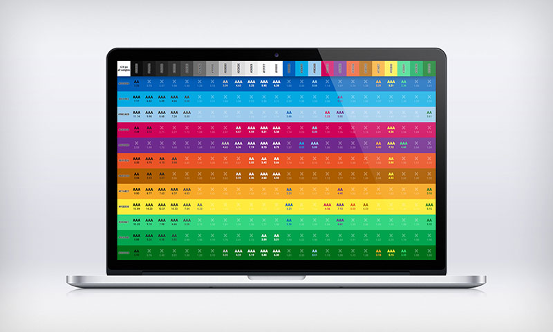

# wcag-color-contrast-matrix
Based on a list of colors you can update (in a Javascript table embedded), this page shows the level of accessibility (WCAG 2.0 AA or AAA levels) for all combinations (text vs background).

